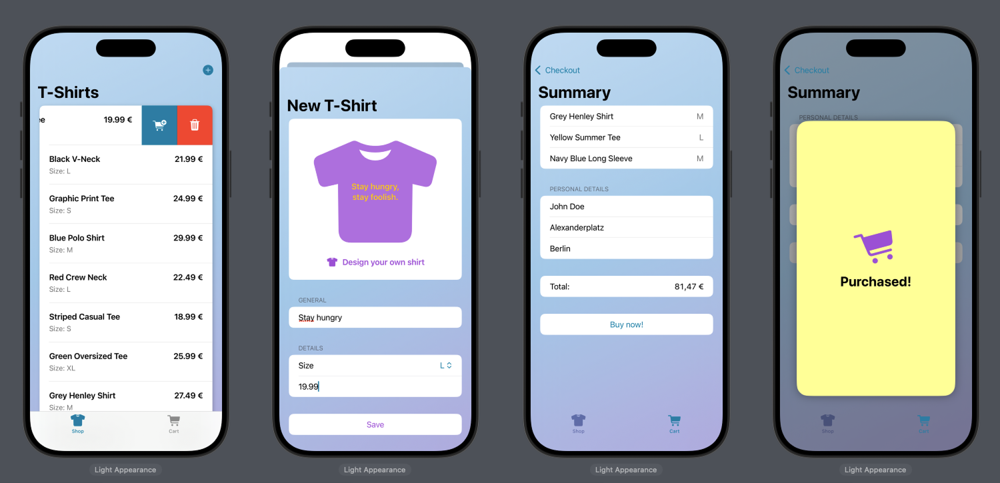

# Sylando

**Sylando** is a SwiftUI-based shopping app where you can browse cool T-Shirts, customize them with inspirational quotes, and manage your cart. From adding shirts to completing purchases, Sylando provides a clean and modern shopping experience. 🛍👕✨

## Features

- ✅ Browse a collection of **T-Shirts**  
- ✅ Add your own T-Shirts with **custom quotes**  
- ✅ Manage selected items in the **shopping cart**  
- ✅ Complete the **checkout process**  
- ✅ Built with **MVVM architecture** for clear separation of concerns  
- ✅ State management with **@ObservedObject** and **@EnvironmentObject**  
- ✅ **Repository pattern** for clean data access  
- ✅ **Dependency Injection** for flexible switching between local and remote data (e.g., Local vs. RemoteQuoteRepository)  
- ✅ Local repositories used in Previews to avoid unnecessary API calls  

## Technologies

- SwiftUI for user interface  
- MVVM for architecture and data binding  
- ObservableObject, @StateObject, @ObservedObject, and @EnvironmentObject for state management  
- Repository pattern for abstracting data sources  
- Dependency Injection for testing and previews  
- Async/await for asynchronous operations  
- Error handling with custom error types (`HTTPError`, `QuoteError`)  
- TabView for app navigation  

## How to Run

1. Click the green **"Code"** button on this repository and select **"Open with Xcode"** (if available), or download the ZIP and open the project manually.  
2. Alternatively, open the `.xcodeproj` or `.xcworkspace` file directly in **Xcode**.  
3. Click the **Run** ▶️ button in the top toolbar to build and launch the app in the iOS Simulator or on a physical device.  
4. Use the app to **browse shirts, add them to your cart, customize them with quotes, and simulate a purchase flow**.  

---

📝 Disclaimer  

This project was developed as part of my training. The source code, structure, and documentation are my own work.  

© 2025 Jeff Braun. All rights reserved. Licensed under the [MIT License](./LICENSE).  
